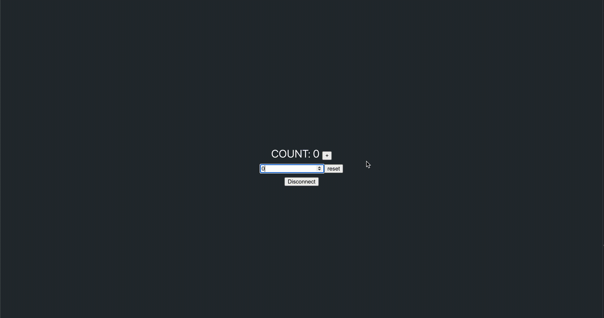

# Using Terrain

With Terrain installed you can now scaffold your new application:

```sh
terrain new my-terra-dapp
cd my-terra-dapp
npm install
```

## Project structure

The following structure shows your scaffolded project:

```
.
├── contracts              # The contracts' source code.
│   ├── counter
│   └── ...                # Add more contracts here.
├── frontend               # The front-end application.
├── lib                    # Predefined functions for task and console.
├── tasks                  # Predefined tasks.
├── keys.terrain.js        # Keys for signing transactions.
├── config.terrain.json    # Config for connections and contract deployments.
└── refs.terrain.json      # Deployed code and contract references.
```

## Deployment

To deploy the application, run the following command:

```sh
terrain deploy counter --signer validator
```

The deploy command performs the following steps automatically:

* Builds the counter smart contract
* Optimizes the counter smart contract
* Uploads counter smart contract to LocalTerra
* InstantiatesInstantiate the deployed smart contract

## Interacting with the deployed contract

The template comes with several predefined helpers in `lib/index.js`. Use them to start interacting with your smart contract:

1. Run `terrain console`.

2. With the console open, increment the counter by running the following:

```JavaScript
await lib.increment()
```

You can get the current count by using:

```JavaScript
await lib.getCount()
```

3. After incrementing once, `await lib.getCount()` will return:

```json
{ count: 1 }
```

## Front-end scaffolding

Terrain also scaffolds a very simple frontend.

In the Terra Station Chrome extension, switch the network to Localterra.

1. To use the front end, run the following commands in order. The terrain sync-refs command copies your deployed contract addresses to the front-end part of the codebase.

```
terrain sync-refs
cd frontend
npm install
npm start
```

2. Import the following seed phrase in Terra Station to access the sole validator on the LocalTerra network and gain funds to get started with smart contracts:

```
satisfy adjust timber high purchase tuition stool faith fine install that you unaware feed domain license impose boss human eager hat rent enjoy dawn
```

3. With Localterra selected in Terra Station and the local seed phrase imported, you can now increment and reset the counter from the front end.

### Demo



## Advanced usage

For more advanced use cases, like deploying to the testnet or mainnet, see [Terrain's readme](https://github.com/iboss-ptk/terrain#readme).
